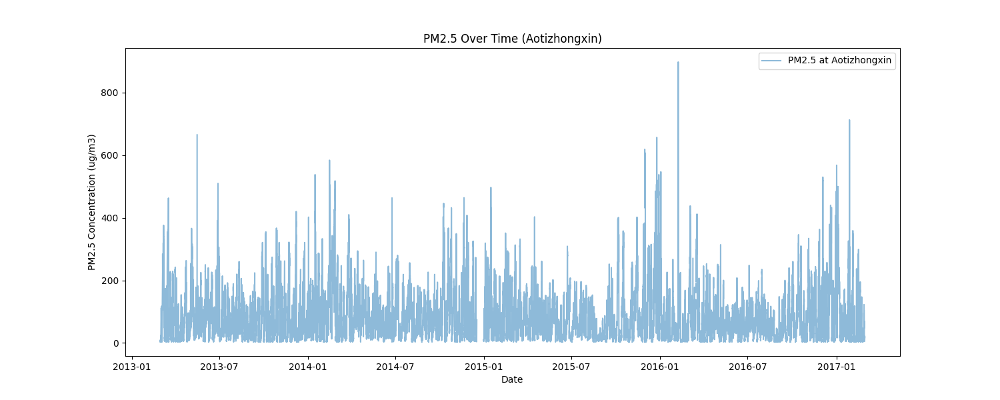
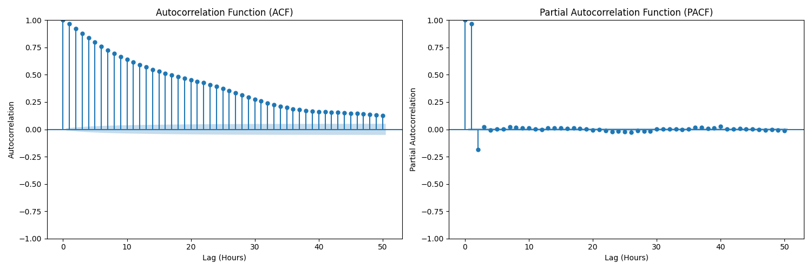
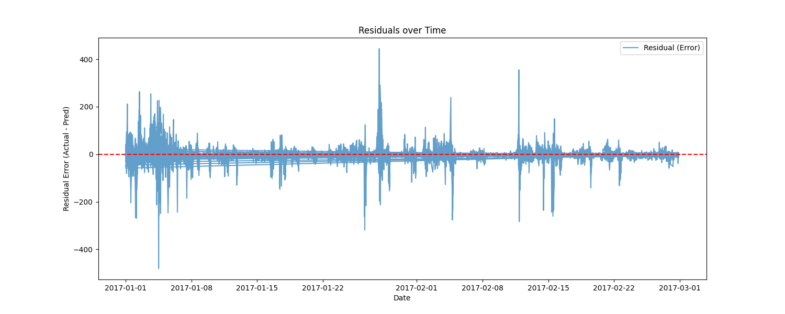
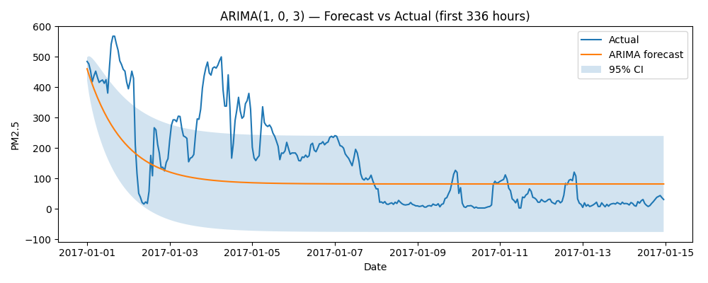

# Báo Cáo Dự Án: Dự Báo Chất Lượng Không Khí Beijing (PM2.5)
---

## 1. Giới thiệu
Dự án nhằm mục tiêu xây dựng pipeline dự báo nồng độ bụi mịn PM2.5 theo giờ tại Bắc Kinh (trạm Aotizhongxin). Chúng tôi áp dụng hai phương pháp tiếp cận:
1. **Regression Baseline**: Hồi quy có giám sát sử dụng đặc trưng trễ (Lag features) và biến thời gian.
2. **ARIMA**: Mô hình chuỗi thời gian đơn biến (Univariate Time Series).

## 2. Kết luận Chiến lược
> **Khả năng triển khai**: Mô hình **Regression Baseline** vượt trội hoàn toàn về độ chính xác ngắn hạn (RMSE ~25) so với ARIMA (RMSE ~104) trong bối cảnh dự báo thời gian thực (Horizon=1).

**Lý do chính**: Regression tận dụng được dữ liệu "tươi" nhất (PM2.5 tại giờ trước đó) để dự báo giờ tiếp theo liên tục. Trong khi ARIMA (cấu hình hiện tại) thực hiện dự báo dài hạn (long-term forecast) dẫn đến sai số tích lũy lớn.

---

## 3. Phân tính Chi tiết & Trả lời Câu hỏi Thực hành

### Q1: Phân tích Dữ liệu Chuỗi thời gian (EDA)
**1. Tổng quan Xu hướng PM2.5:**

*Hình 1: Chuỗi thời gian PM2.5 (2013-2017).*

Có thể thấy tính mùa vụ rõ rệt (cao điểm vào mùa đông) và các đợt ô nhiễm đột biến (spikes) xuất hiện thường xuyên.

**2. Tính dừng & Tự tương quan:**

*Hình 2: Biểu đồ ACF/PACF.*
- **Tính liên tục**: Dữ liệu có tính chu kỳ ngày (24h) và tuần (168h).
- **Tự tương quan (Autocorrelation)**:
    - **Lag 24h (~0.40)**: Tương quan khá mạnh, phản ánh nhịp sinh hoạt và thời tiết lặp lại theo ngày.
    - **Lag 168h (~0.01)**: Tương quan yếu, cho thấy biến động PM2.5 ít có tính chu kỳ tuần cố định hơn so với chu kỳ ngày.
- **Tính dừng (Stationarity)**:
    - Kiểm định ADF cho p-value ~ 0.0 -> Chuỗi có xu hướng dừng (hoặc gần dừng) sau khi xử lý missing, đủ điều kiện để chạy ARIMA.

### Q2: Đánh giá Baseline Regression

*Hình 3: Dự báo Regression vs Thực tế (Mẫu 500 giờ đầu).*
- **Quan sát**: Đường dự báo (Cam) bám rất sát đường thực tế (Xanh). Điều này nhờ vào feature `PM2.5_lag1`, mô hình học được bài học "giá trị giờ trước là dự báo tốt nhất cho giờ sau".

*Hình 4: Phần dư (Sai số) của mô hình Regression.*
- **Kết quả**: 
    - **RMSE: 25.33** | **MAE: 12.32**
    - R-squared: 0.95 (Rất tốt)
- **Phân tích sai số**:
    - Phần dư dao động quanh 0, nhưng có những điểm vọt lố (spikes) rất cao (sai số > 100). Đây là thời điểm chất lượng không khí thay đổi đột ngột (gió mùa về, bão bụi) mà mô hình chưa kịp thích ứng chỉ sau 1 giờ.

### Q3: Phân tích ARIMA (1, 0, 3)

*Hình 5: Dự báo ARIMA (Forecast Horizon dài).*
- **Quan sát**: Trái ngược với Regression, đường dự báo ARIMA (Cam) nhanh chóng đi về mức trung bình và nằm ngang, không bắt được các dao động thực tế.

- **Kết quả**:
    - **RMSE: 104.10** | **MAE: 77.69**
- **Tại sao kém hơn Regression?**:
    - Pipeline hiện tại chạy ARIMA theo chế độ dự báo dài hạn (forecast toàn bộ tập test một lần).
    - Không cập nhật (re-fit hoặc update) dữ liệu lịch sử mới nhất cho mô hình sau mỗi bước dự báo.
    - **Bài học**: ARIMA truyền thống không phù hợp cho "Online Forecasting" nếu không được thiết kế dạng Rolling/Expanding window.

---

## 4. Chủ đề Nâng cao: So sánh Regression vs ARIMA

| Tiêu chí        | Regression Baseline             | ARIMA (Forecasting)                       | Nhận xét                                 |
| :-------------- | :------------------------------ | :---------------------------------------- | :--------------------------------------- |
| **Cơ chế**      | Dự báo 1 bước (dùng t-1 đoán t) | Dự báo nhiều bước (dùng t đoán t+1...t+n) | Regression lợi thế nhờ cập nhật liên tục |
| **RMSE**        | **25.33** (Tốt)                 | 104.10 (Kém)                              | Regression bám sát thực tế hơn           |
| **Xử lý Spike** | Phản ứng nhanh (có độ trễ 1h)   | Bị mượt hoá (phẳng), không bắt được đỉnh  | Regression tốt hơn cho cảnh báo sớm      |
| **Tốc độ**      | Rất nhanh (Fit 1 lần)           | Chậm (Đặc biệt nếu Re-fit liên tục)       | Regression scalable hơn                  |

### Câu trả lời cho Chủ đề 1:
1. **Hiệu suất H=1**: Regression chiến thắng tuyệt đối.
2. **Khả năng bắt Spike**: Regression phản ứng tốt hơn nhờ biến Lag 1h và 24h giữ thông tin về mức độ ô nhiễm hiện tại. ARIMA có xu hướng quay về giá trị trung bình (mean reversion) khi dự báo xa.
3. **Lựa chọn triển khai**: Chọn **Regression** (hoặc nâng cấp lên GBM/LSTM). Nó đơn giản, dễ thêm biến phụ trợ (mưa, gió, thứ trong tuần) và dễ bảo trì hệ thống Real-time.

---

## 5. Khuyến nghị Hành động (Dành cho nhà quản lý)
1. **Hệ thống cảnh báo**: Nên triển khai mô hình Regression để dự báo trước 1 giờ. Độ chính xác hiện tại (MAE ~12 đơn vị PM2.5) là chấp nhận được để phát cảnh báo mức độ "Có hại" hay "Nguy hại".
2. **Cải thiện mô hình**: Tập trung xử lý các điểm "Spike" (đỉnh ô nhiễm đột ngột). Có thể thêm feature "tốc độ gió" (WSPM) vì gió mạnh thường làm giảm PM2.5 nhanh chóng.
3. **Vận hành**: Thiết lập pipeline tự động (như `run_papermill.py`) để tái huấn luyện mô hình định kỳ hàng tuần, cập nhật xu hướng mùa vụ mới.
