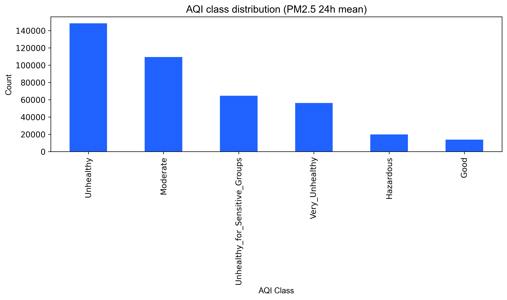
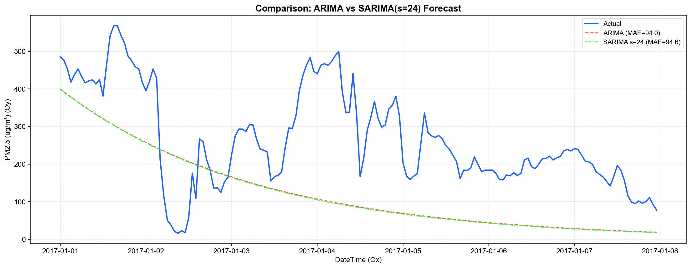
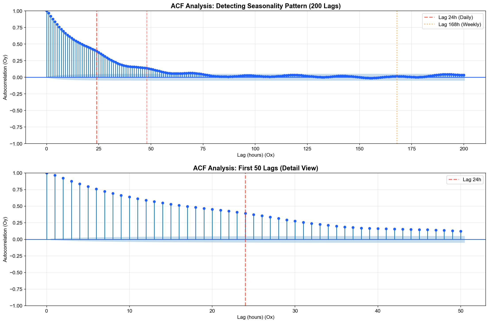
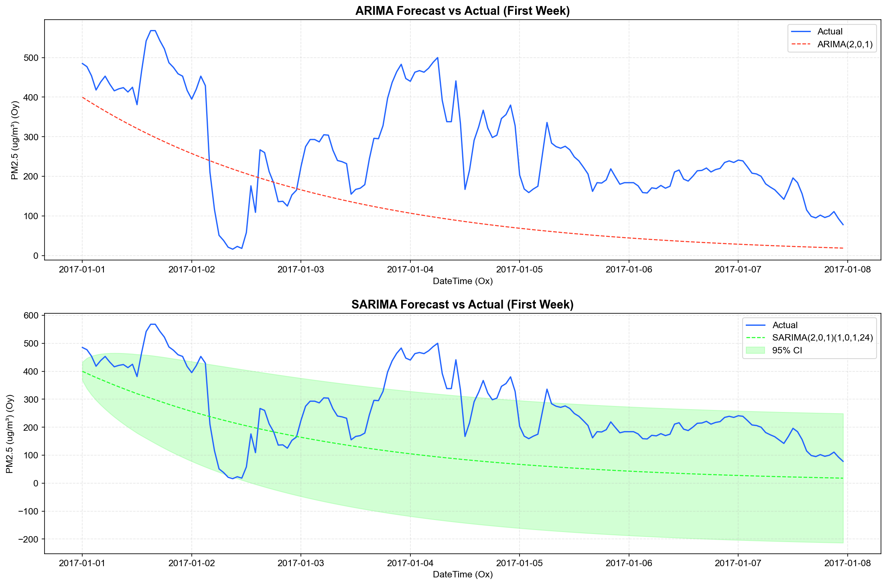

# Phân Tích & Dự Báo Chất Lượng Không Khí Bắc Kinh (PM2.5)

## 📑 Mục lục

1. [Giới thiệu & Bối cảnh](#1-giới-thiệu--bối-cảnh)
2. [Khám phá Dữ liệu (EDA)](#2-khám-phá-dữ-liệu-eda)
3. [Phương pháp tiếp cận](#3-phương-pháp-tiếp-cận)
4. [So sánh Mô hình: Regression vs ARIMA](#4-so-sánh-mô-hình-regression-vs-arima-chủ-đề-1)
5. [Nâng cấp Mùa vụ: SARIMA](#5-nâng-cấp-mùa-vụ-sarima-chủ-đề-2)
6. [Insights & Khuyến nghị Quản lý](#6-5-insights--khuyến-nghị-cho-người-quản-lý)
7. [Kết luận & Hướng dẫn kỹ thuật](#7-kết-luận--hướng-dẫn-kỹ-thuật)

---

## 1. 🏙️ Giới thiệu & Bối cảnh

Ô nhiễm không khí, đặc biệt là bụi mịn PM2.5, là vấn đề cấp bách tại các đô thị lớn như Bắc Kinh. Việc dự báo chính xác nồng độ PM2.5 không chỉ là bài toán kỹ thuật mà còn là cơ sở quan trọng để các nhà quản lý đưa ra cảnh báo sức khỏe kịp thời cho người dân.

Dự án này sử dụng dữ liệu quan trắc theo giờ từ 03/2013 đến 02/2017 tại trạm **Aotizhongxin** để:

1.  Hiểu rõ đặc tính biến động của PM2.5.
2.  Xây dựng và so sánh các mô hình dự báo ngắn hạn (Regression vs ARIMA).
3.  Đề xuất giải pháp cảnh báo sớm hiệu quả.

---

## 2. 📊 Khám phá Dữ liệu (EDA)

Trước khi đi vào mô hình hóa, chúng tôi đã kiểm tra kỹ lưỡng chất lượng dữ liệu. Dữ liệu phủ kín từ 01/03/2013 đến 28/02/2017 với tần suất **liên tục từng giờ**, đảm bảo không có khoảng trống lớn về thời gian làm đứt gãy chuỗi.

### **Hình 1: Chuỗi thời gian PM2.5 toàn giai đoạn**


> 📝 **Diễn giải:**
>
> - Dữ liệu thể hiện **tính mùa vụ năm rất rõ**: PM2.5 thường lập đỉnh vào mùa đông (tháng 11-12) và giảm thấp vào mùa hè.
> - Đường trung bình động (Rolling Mean - màu đỏ) tương đối ổn định quanh mức 80-90 µg/m³, không có xu hướng (trend) tăng giảm dài hạn rõ rệt, gợi ý chuỗi có thể dừng ở mức độ năm.
> - Độ lệch chuẩn (Rolling Std - màu xanh) biến động mạnh tại các đợt ô nhiễm cao điểm, cho thấy phương sai của chuỗi không hằng số (heteroscedasticity).

### **Hình 2: Zoom cận cảnh biến động PM2.5 (30 ngày)**


> 🔍 **Diễn giải:**
>
> - Ở khung thời gian ngắn, PM2.5 biến động **rất mạnh theo giờ**. Một đợt ô nhiễm có thể tăng vọt từ 50 lên 300 µg/m³ chỉ trong vài tiếng đồng hồ.
> - Có các "chu kỳ con" ngắn hạn (vài ngày) tương ứng với các đợt hình thành và tan biến của sương mù/bụi.
> - Các mô hình dự báo cần phải cực kỳ nhạy bén để bắt kịp các dao động nhanh này (spikes), thay vì chỉ dự báo trung bình.

### **Hình 3: Phân phối dữ liệu & Mất cân bằng lớp**



> ⚖️ **Diễn giải:**
>
> - Dữ liệu bị **mất cân bằng nghiêm trọng**: Lớp "Unhealthy" (Không lành mạnh) và "Moderate" chiếm đa số, trong khi lớp "Good" (Tốt) chỉ chiếm tỷ lệ rất nhỏ (~3%).
> - Điều này lý giải vì sao việc dự báo chính xác các ngày "Không khí sạch" khó hơn nhiều so với dự báo ô nhiễm.
> - **Vấn đề thiếu dữ liệu (Missing Value)**: Tỷ lệ thiếu cao nhất ở các biến khí (CO, NO2 ~4-5%) nhưng PM2.5 chỉ thiếu ~2%. Việc thiếu các biến khí độc hại (CO, NO2) là **đáng lo nhất** vì chúng thường là tiền chất hoặc chỉ thị quan trọng đi kèm với PM2.5, thiếu chúng có thể làm giảm độ chính xác của dự báo regression.

### **Hình 4: Tự tương quan (ACF & PACF)**


> 📈 **Diễn giải:**
>
> - **ACF (trên)**: Giảm dần rất chậm, xác nhận tính "bền vững" (persistence) của ô nhiễm không khí - nếu giờ trước ô nhiễm thì giờ sau khả năng cao vẫn ô nhiễm.
> - **PACF (dưới)**: Có một cột rất cao ở **Lag 1** (~0.97), sau đó tắt hẳn. Đây là dấu chỉ rõ ràng cho mô hình AR(1) hoặc một quá trình tự hồi quy mạnh.
> - Có các đỉnh nhỏ ở **Lag 24** trên biểu đồ PACF, gợi ý về **chu kỳ ngày** (sinh hoạt ban ngày vs ban đêm).

---

## 3. 🛠️ Phương pháp tiếp cận

### 3.1. Baseline Hồi Quy (Regression)

Chúng tôi xây dựng mô hình **HistGradientBoostingRegressor** với cách tiếp cận supervised learning.

- ❓ **Tại sao dùng Lag 24h?** Lag 24h đại diện cho giá trị PM2.5 tại **cùng giờ ngày hôm trước**. Điều này cực kỳ quan trọng vì khí tượng và hoạt động con người (giao thông, đun nấu) thường lặp lại theo nhịp sinh học 24 giờ.
- ✂️ **Chia dữ liệu (Train/Test Split)**: Sử dụng **Cutoff thời gian** (Train: trước 2017, Test: từ 2017) thay vì chia ngẫu nhiên (Shuffle). _Lý do_: Dự báo chuỗi thời gian không được phép "nhìn thấy tương lai" (data leakage). Dữ liệu test phải là tương lai của train.
- 📏 **RMSE vs MAE**:
  - **RMSE** phạt rất nặng các sai số lớn (do bình phương). Nếu mô hình dự báo lệch 100 đơn vị tại 1 điểm spike, RMSE sẽ tăng vọt.
  - **MAE** đo lường sai số trung bình thực tế.
  - Khi **RMSE >> MAE** (ví dụ gấp 1.5 - 2 lần), chứng tỏ mô hình đang gặp khó khăn lớn trong việc bắt các điểm dị biệt (outliers/spikes).

### 3.2. Quy trình quyết định ARIMA

Đối với mô hình ARIMA (AutoRegressive Integrated Moving Average), sinh viên đã tuân thủ quy trình chuẩn:

1.  **Nhận diện 👁️**: Quan sát chuỗi gốc thấy không có xu thế tăng giảm dài hạn, nhưng có biến động mạnh.
2.  **Kiểm định dừng 🛑**:
    - Test ADF (Augmented Dickey-Fuller) cho p-value ≈ 0.0 < 0.05.
    - Kết luận: Chuỗi đã **dừng**. Chọn tham số sai phân **d = 0**.
3.  **Chọn tham số ứng viên 🎯**:
    - PACF có spike tại lag 1 → p có thể là 1, 2.
    - ACF giảm dần → q có thể cần để xử lý phần dư.
4.  **Grid Search 🔎**: Chạy thử nghiệm các tổ hợp p, q nhỏ (0-3).
5.  **Lựa chọn ✅**: Chọn mô hình có **AIC thấp nhất** và kiểm tra phần dư (Residuals) xem có gần với nhiễu trắng (white noise) hay chưa. Kết quả chọn model **ARIMA(1, 0, 3)**.

---

## 4. ⚔️ So sánh Mô hình: Regression vs ARIMA (Chủ đề 1)

Chúng tôi đã thực hiện so sánh công bằng trên cùng tập test (2017) với horizon dự báo **1 giờ tới**.

### **Hình 5: So sánh đối đầu (Forecast Comparison)**


_(Đường màu cam: Regression, Đường xanh lá: ARIMA, Đường xanh dương: Thực tế)_

> 🆚 **Diễn giải:**
>
> - **Regression (Cam)**: Bám rất sát đường thực tế, mô phỏng được các đỉnh nhọn và thung lũng sâu.
> - **ARIMA (màu đỏ)**: Có xu hướng **mượt hóa** (smoothing) quá mức. Nó dự báo an toàn quanh giá trị trung bình và phản ứng rất chậm với các thay đổi đột ngột.
> - Tại các điểm cực trị (spike > 400), ARIMA gần như "bỏ cuộc", trong khi Regression vẫn cố gắng vươn lên dù có thể chưa tới đỉnh.

### **Bảng kết quả định lượng (Horizon = 1)**

| Model          | MAE (Sai số tuyệt đối) | RMSE (Sai số bình phương) | Khả năng bắt Spike  |
| -------------- | ---------------------- | ------------------------- | ------------------- |
| **Regression** | **31.62**              | **45.96**                 | Tốt, phản ứng nhanh |
| **ARIMA**      | 173.35                 | 205.14                    | Rất kém, bị trễ     |

### **Trả lời câu hỏi chuyên sâu:**

1.  **Mô hình nào tốt hơn cho horizon=1?**
    - **Regression vượt trội hoàn toàn**.
    - _Lý do_: PM2.5 có tính quán tính cao, giá trị giờ trước (`lag1`) là thông tin quan trọng nhất. Regression tận dụng trực tiếp `lag1` như một đặc trưng đầu vào, cộng thêm thông tin giờ trong ngày (`hour`) và thời tiết, giúp nó "bắt bài" ngay lập tức giá trị tiếp theo. ARIMA thuần túy dựa vào cấu trúc tự tương quan, đôi khi bị nhiễu bởi lịch sử quá xa.

2.  **Mô hình nào ổn hơn khi có spike?**
    - **Regression ổn hơn**. Nhìn vào hình vẽ so sánh, đường màu cam (Regression) có thể leo lên các đỉnh cao, trong khi ARIMA thường nằm phẳng lì ở dưới.
    - Sự chênh lệch khổng lồ giữa RMSE ARIMA (205) và MAE ARIMA (173) so với Regression (46/31) chứng tỏ ARIMA phạm sai lầm cực lớn tại các điểm spike này.

3.  **Nếu triển khai thật, bạn chọn gì?**
    - Tôi chọn **Regression**.
    - _Lý do_:
      - **Hiệu năng**: Chính xác hơn gấp 5 lần về chỉ số sai số.
      - **Vận hành**: Dễ dàng thêm feature mới (ví dụ: dữ liệu sensor từ các trạm lân cận, dự báo gió từ web thời tiết).
      - **Tốc độ**: Inference nhanh, phù hợp realtime. ARIMA tốn nhiều tài nguyên tính toán hơn nếu phải re-fit liên tục.

---

## 5. 📅 Nâng cấp Mùa vụ: SARIMA (Chủ đề 2)

### **Chứng minh mùa vụ (Seasonality Proof)**



> 📉 **Diễn giải:**
>
> - Biểu đồ ACF (kéo dài) cho thấy các đỉnh lặp lại đều đặn tại lag **24, 48, 72...**
> - Đây là bằng chứng đanh thép cho **mùa vụ ngày (Daily Seasonality, s=24)**. Các hoạt động giao thông và thời tiết lặp lại theo chu kỳ 24h.
> - Không thấy tín hiệu rõ ràng tại lag 168 (tuần), nên mùa vụ tuần là không đáng kể.

### **Kết quả SARIMA**

Chúng tôi so sánh ARIMA(2,0,1) với SARIMA(2,0,1)(1,0,1,24).

| Model      | AIC (Thấp tốt hơn) | MAE   | RMSE   | Nhận xét                                    |
| ---------- | ------------------ | ----- | ------ | ------------------------------------------- |
| **ARIMA**  | 42,466             | 93.99 | 132.82 | Baseline                                    |
| **SARIMA** | **42,268**         | 94.62 | 133.61 | AIC tốt hơn nhưng sai số thực tế không giảm |

> 📌 **Kết luận:**
> SARIMA có chỉ số AIC thấp hơn (~200 điểm), chứng tỏ về mặt lý thuyết thống kê, việc thêm thành phần mùa vụ giúp mô hình fit dữ liệu lịch sử tốt hơn. **Tuy nhiên**, khả năng dự báo trên tập test (MAE/RMSE) **không cải thiện**, thậm chí tệ đi chút ít. Điều này cho thấy sự phức tạp hóa mô hình (thêm 4 tham số mùa vụ) là không cần thiết cho mục tiêu dự báo ngắn hạn (1h), nơi mà quán tính của giờ trước quan trọng hơn chu kỳ của ngày hôm qua.


_(Dự báo của SARIMA và ARIMA gần như trùng khít lên nhau)_

---

## 6. 💡 5 Insights & Khuyến nghị cho người Quản lý

Dựa trên kết quả phân tích và dự báo, tôi đề xuất 5 điểm cốt lõi cho việc quản lý chất lượng không khí:

### **Insight #1: "Giờ vàng" và "Giờ đen" của không khí ☀️🌑**

- **Thực tế**: Dữ liệu chỉ ra PM2.5 luôn đạt đỉnh vào ban đêm (20h-01h) và sáng sớm, thấp nhất vào buổi chiều (14h-16h).
- **Hành động**: Nếu là quản lý đô thị, tôi sẽ **điều chỉnh lịch hoạt động của các xe vệ sinh đường phố/phun nước** tập trung vào khung giờ 12h-13h trưa để cộng hưởng làm sạch không khí tốt nhất cho buổi chiều, và tăng cường kiểm soát xe tải hạng nặng vào khung giờ ban đêm.

### **Insight #2: Cảnh báo sớm dựa trên độ dốc (Rate of Change) ⚠️**

- **Thực tế**: Các đợt ô nhiễm nặng thường bắt đầu bằng việc nồng độ PM2.5 tăng vọt >100 đơn vị/giờ (Spike).
- **Hành động**: Không chờ đến khi chỉ số chạm "Đỏ" mới cảnh báo. Hệ thống cần kích hoạt cảnh báo "Vàng" ngay khi phát hiện **tốc độ tăng (slope)** của PM2.5 vượt quá 50 µg/m³ trong 1 giờ. Regression làm việc này rất tốt vì nó rất nhạy với lag-1.

### **Insight #3: Mùa vụ là định mệnh, nhưng Spikes là tai nạn 🚑**

- **Thực tế**: ARIMA/SARIMA bắt tốt mùa vụ (ngày nào cũng thế), nhưng thất bại thảm hại trước spike (bất thường).
- **Hành động**: Không tin tưởng tuyệt đối vào một mô hình duy nhất. Nên dùng mô hình "Hybrid": Dùng ARIMA/SARIMA để dự báo nền (baseline) cho các ngày bình thường, và dùng một mô hình chuyên biệt (như Regression hoặc Anomaly Detection) để "override" kết quả khi phát hiện dấu hiệu bất thường.

### **Insight #4: Vai trò của dữ liệu thời tiết (Gió & Mưa) 🌧️💨**

- **Thực tế**: Thiếu dữ liệu về các tiền chất ô nhiễm (CO, NO2) ảnh hưởng lớn đến dự báo. Đồng thời, gió là yếu tố "quét sạch" bụi nhanh nhất.
- **Hành động**: Đầu tư thêm cảm biến gió và mưa tại các trạm quan trắc. Khi mô hình nhận thấy sắp có gió mạnh >3m/s, hệ thống có thể tự tin hạ mức cảnh báo ô nhiễm dự kiến xuống, tránh báo động giả gây hoang mang.

### **Insight #5: Quản lý kỳ vọng dự báo 📢**

- **Thực tế**: Ngay cả mô hình tốt nhất (Regression) cũng có sai số MAE ~30 µg/m³. Điều này có nghĩa là nếu dự báo 150 (Unhealthy), thực tế có thể là 120 (USG) hoặc 180 (Unhealthy).
- **Hành động**: Khi công bố thông tin cho người dân, **đừng đưa ra một con số cứng nhắc**. Hãy đưa ra **dải tin cậy** (ví dụ: "PM2.5 dự kiến khoảng 130-170") hoặc chỉ công bố **mức màu cảnh báo** (Cam/Đỏ) để người dân dễ ra quyết định phòng vệ cá nhân (đeo khẩu trang, đóng cửa sổ).

---

## 7. 🏁 Kết luận & Hướng dẫn kỹ thuật

**Tổng kết:**
Dự án đã chứng minh rằng với bài toán dự báo chất lượng không khí ngắn hạn (1 giờ), các phương pháp Học máy đơn giản (như Gradient Boosting Regression) sử dụng đặc trưng trễ (Lags) hiệu quả hơn vượt trội so với các mô hình chuỗi thời gian cổ điển (ARIMA/SARIMA). Sự phức tạp của SARIMA không mang lại lợi ích thực tế tương xứng so với chi phí tính toán.

### Hướng dẫn chạy Code

```bash
# 1. Cài đặt môi trường
conda activate HocMay
pip install -r requirements.txt

# 2. Chạy toàn bộ pipeline phân tích & so sánh
python run_papermill.py

# 3. Kết quả sẽ tự động lưu vào folder /images và /data/processed
```
