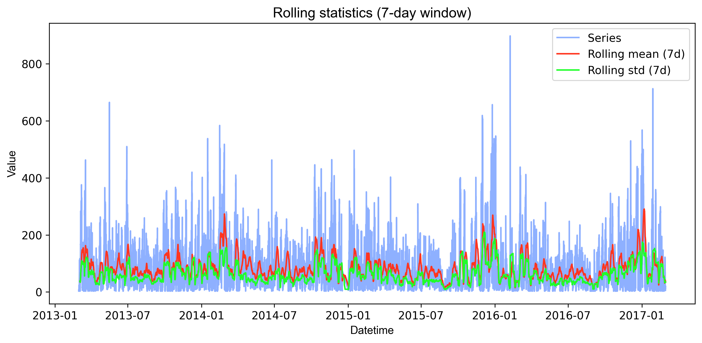
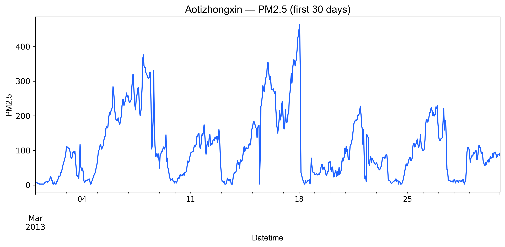
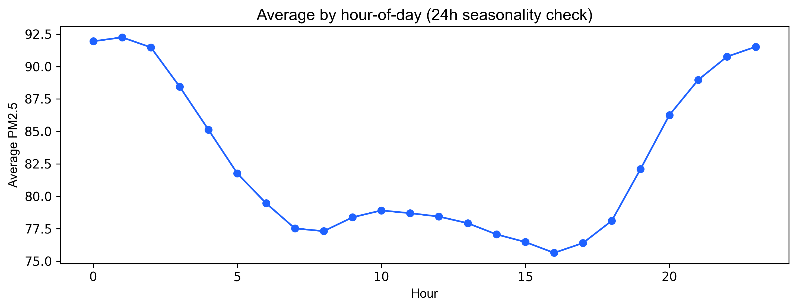
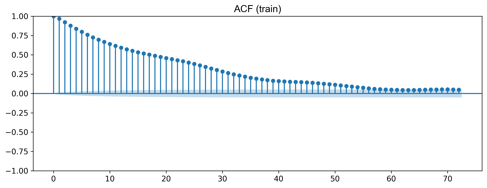
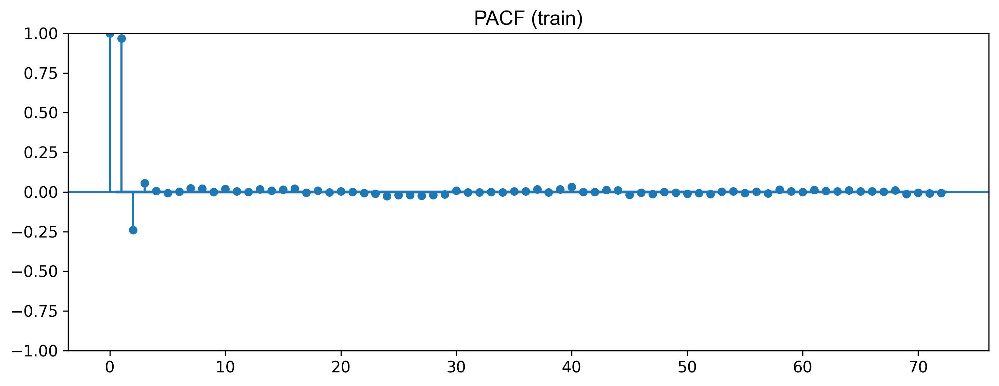
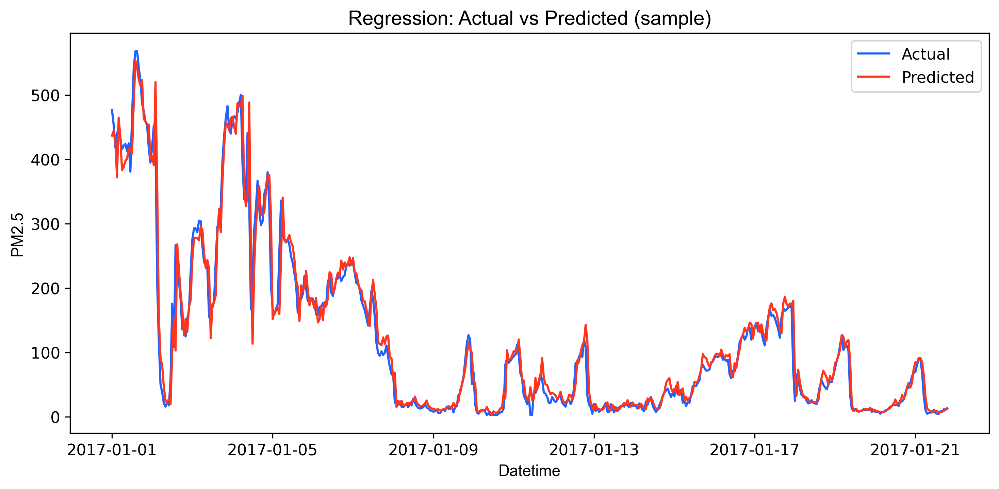
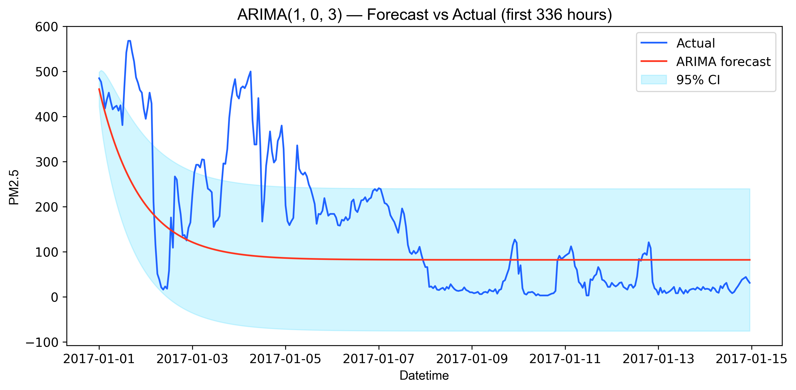

# Dự Báo Chất Lượng Không Khí Bắc Kinh (PM2.5)

> **Dự án phân tích và dự báo nồng độ bụi mịn PM2.5 theo giờ tại Bắc Kinh (2013-2017)**

---

## 📑 Mục lục

1. [Giới thiệu](#1-giới-thiệu)
2. [Dữ liệu](#2-dữ-liệu)
3. [Phân tích Khám phá Dữ liệu (EDA)](#3-phân-tích-khám-phá-dữ-liệu-eda)
4. [Mô hình Dự báo](#4-mô-hình-dự-báo)
5. [Kết quả & So sánh](#5-kết-quả--so-sánh)
6. [Insights & Khuyến nghị](#6-insights--khuyến-nghị)
7. [Hướng dẫn Cài đặt & Chạy](#7-hướng-dẫn-cài-đặt--chạy)
8. [Kết luận](#8-kết-luận)

---

## 1. Giới thiệu

### Bối cảnh
Ô nhiễm không khí tại Bắc Kinh là vấn đề sức khỏe cộng đồng nghiêm trọng. **PM2.5** (bụi mịn đường kính ≤ 2.5 micromet) là chỉ số quan trọng nhất vì chúng có thể xâm nhập sâu vào phổi và máu, gây ra các bệnh hô hấp và tim mạch.

### Mục tiêu
- Phân tích xu hướng và tính mùa vụ của PM2.5
- Xây dựng mô hình dự báo PM2.5 cho **1 giờ tiếp theo**
- So sánh hiệu quả giữa **Regression** (học có giám sát) và **ARIMA** (chuỗi thời gian)
- Đưa ra khuyến nghị cho hệ thống cảnh báo sớm

### Phương pháp tiếp cận
| Phương pháp | Mô tả |
|-------------|-------|
| **Regression Baseline** | Sử dụng đặc trưng trễ (lag features) và biến thời gian để dự báo |
| **ARIMA** | Mô hình chuỗi thời gian đơn biến (AutoRegressive Integrated Moving Average) |

---

## 2. Dữ liệu

### Nguồn dữ liệu
- **Dataset**: Beijing Multi-Site Air Quality Data (UCI Machine Learning Repository)
- **Thời gian**: 01/03/2013 - 28/02/2017 (~4 năm)
- **Tần suất**: Theo giờ
- **Số trạm đo**: 12 trạm trên khắp Bắc Kinh

### Các biến chính

| Nhóm | Biến | Đơn vị | Mô tả |
|------|------|--------|-------|
| **Ô nhiễm** | PM2.5 | µg/m³ | Bụi mịn (mục tiêu dự báo) |
| | PM10 | µg/m³ | Bụi thô |
| | SO2, NO2, CO, O3 | µg/m³ | Các khí ô nhiễm khác |
| **Thời tiết** | TEMP | °C | Nhiệt độ |
| | PRES | hPa | Áp suất khí quyển |
| | DEWP | °C | Điểm sương |
| | RAIN | mm | Lượng mưa |
| | WSPM | m/s | Tốc độ gió |

### Phân loại chất lượng không khí (AQI)
Dựa trên nồng độ PM2.5 trung bình 24 giờ:

| Mức độ | PM2.5 (µg/m³) | Số mẫu | Tỷ lệ |
|--------|---------------|--------|-------|
| 🟢 Good | 0 - 9 | 13,924 | 3.4% |
| 🟡 Moderate | 9.1 - 35.4 | 109,549 | 26.6% |
| 🟠 Unhealthy for Sensitive Groups | 35.5 - 55.4 | 64,731 | 15.7% |
| 🔴 Unhealthy | 55.5 - 125.4 | 148,558 | 36.1% |
| 🟣 Very Unhealthy | 125.5 - 225.4 | 56,242 | 13.7% |
| ⚫ Hazardous | > 225.4 | 19,931 | 4.8% |

> **Nhận xét**: Gần **70% thời gian** không khí Bắc Kinh ở mức **không tốt cho sức khỏe trở lên** (Unhealthy+). Chỉ có 3.4% thời gian đạt mức "Tốt".

---

## 3. Phân tích Khám phá Dữ liệu (EDA)

### 3.1. Chuỗi thời gian PM2.5 toàn giai đoạn


*Hình 1: Chuỗi PM2.5 theo giờ với đường trung bình động (rolling mean) và độ lệch chuẩn.*

**Diễn giải:**
- Dữ liệu thể hiện **tính mùa vụ rõ rệt**: PM2.5 cao vào mùa đông (tháng 11-2) do đốt than sưởi ấm và điều kiện khí tượng bất lợi.
- Có nhiều **đợt ô nhiễm đột biến (spikes)** vượt 400-500 µg/m³, đặc biệt vào cuối năm 2015 và đầu 2017.
- Đường rolling mean cho thấy xu hướng tương đối ổn định, không có trend tăng/giảm rõ ràng theo năm.

### 3.2. PM2.5 chi tiết 30 ngày (Zoom)


*Hình 2: PM2.5 trong 30 ngày đầu tiên của dữ liệu.*

**Diễn giải:**
- Ở quy mô ngày, ta thấy **biến động theo chu kỳ ngày đêm**: PM2.5 thường tăng vào buổi sáng (giờ cao điểm giao thông) và giảm vào chiều tối.
- Các đợt ô nhiễm có thể kéo dài **2-5 ngày liên tục** trước khi được gió hoặc mưa làm sạch.
- Sự biến động trong ngày có thể lên tới **100-200 µg/m³**, cho thấy tầm quan trọng của dự báo theo giờ.

### 3.3. Tính mùa vụ theo giờ trong ngày


*Hình 3: Biến động PM2.5 trung bình theo giờ trong ngày.*

**Diễn giải:**
- PM2.5 có xu hướng **thấp nhất vào khoảng 14h-16h** (buổi chiều) khi nhiệt độ cao, đối lưu không khí mạnh.
- **Cao nhất vào 1h-3h sáng** (giờ cao điểm đi làm) và **20h-23h** (sinh hoạt buổi tối + nghịch nhiệt ban đêm).
- Pattern này quan trọng cho việc lập lịch cảnh báo và khuyến cáo người dân.

### 3.4. Biểu đồ ACF và PACF


*Hình 4a: Biểu đồ tự tương quan (ACF) - cho thấy mức độ tương quan của chuỗi với chính nó ở các độ trễ khác nhau.*


*Hình 4b: Biểu đồ tự tương quan riêng phần (PACF) - loại bỏ ảnh hưởng của các lag trung gian.*

**Diễn giải:**
- **ACF giảm dần** nhưng vẫn có ý nghĩa thống kê đến lag 50+, cho thấy dữ liệu có **tính bền vững cao** (persistent).
- **PACF có spike mạnh tại lag 1** (autocorr ≈ 0.97), sau đó giảm nhanh. Điều này gợi ý mô hình **AR(1)** hoặc **ARIMA với p nhỏ** là phù hợp.
- Tương quan tại lag 24 (~0.40) xác nhận **chu kỳ ngày** trong dữ liệu.
- **Kết quả kiểm định**: ADF p-value ≈ 0.0 → Chuỗi **dừng** (stationary), có thể áp dụng ARIMA trực tiếp (d=0).

---

## 4. Mô hình Dự báo

### 4.1. Regression Baseline

**Ý tưởng**: Sử dụng giá trị PM2.5 ở các thời điểm trước (lag features) cùng với biến thời gian để dự đoán giá trị giờ tiếp theo.

**Đặc trưng sử dụng**:
- **Lag features**: PM2.5_lag1 (1 giờ trước), PM2.5_lag3 (3 giờ trước), PM2.5_lag24 (24 giờ trước = cùng giờ hôm qua)
- **Biến thời gian**: hour_sin, hour_cos (mã hóa chu kỳ), dow (ngày trong tuần), is_weekend
- **Biến thời tiết**: TEMP, PRES, DEWP, RAIN, WSPM và các lag tương ứng

**Mô hình**: HistGradientBoostingRegressor (scikit-learn)

**Phân chia dữ liệu**:
- Train: Trước 01/01/2017 (~395,301 mẫu)
- Test: Từ 01/01/2017 (~16,716 mẫu)

### 4.2. ARIMA

**Ý tưởng**: Mô hình chuỗi thời gian đơn biến, chỉ dựa vào lịch sử của chính PM2.5 để dự báo.

**Cấu hình**:
- Trạm: Aotizhongxin
- Grid search: p ∈ [0,3], d ∈ [0,2], q ∈ [0,3]
- Tiêu chí chọn: AIC (Akaike Information Criterion)
- **Order tối ưu được chọn**: ARIMA(1, 0, 3)

---

## 5. Kết quả & So sánh

### 5.1. Kết quả Regression


*Hình 5: So sánh giá trị thực tế và dự báo từ mô hình Regression.*

**Diễn giải:**
- Đường dự báo (màu cam) **bám rất sát** đường thực tế (màu xanh), đặc biệt ở các khoảng PM2.5 ổn định.
- Mô hình **phản ứng nhanh** với các biến động: khi PM2.5 tăng đột ngột, dự báo cũng tăng theo (có độ trễ ~1 giờ).
- Sai số lớn nhất xảy ra tại các **điểm đảo chiều đột ngột** (từ tăng sang giảm hoặc ngược lại).

| Metric | Giá trị | Ý nghĩa |
|--------|---------|---------|
| **RMSE** | 25.33 | Sai số trung bình ~25 µg/m³ |
| **MAE** | 12.32 | Sai số tuyệt đối trung bình ~12 µg/m³ |
| **R²** | 0.949 | Mô hình giải thích được 94.9% biến thiên |
| **SMAPE** | 23.8% | Sai số phần trăm đối xứng |

### 5.2. Kết quả ARIMA


*Hình 6: Dự báo ARIMA so với giá trị thực tế trong giai đoạn test.*

**Diễn giải:**
- Đường dự báo ARIMA **nhanh chóng hội tụ về giá trị trung bình** (~82 µg/m³) và nằm gần như phẳng.
- Mô hình **không bắt được các dao động** thực tế, đặc biệt các đợt ô nhiễm cao (>400 µg/m³).
- Đây là hạn chế cố hữu của ARIMA khi dự báo dài hạn (long-horizon forecast) mà không cập nhật dữ liệu mới.

| Metric | Giá trị |
|--------|---------|
| **RMSE** | 104.10 |
| **MAE** | 77.69 |

### 5.3. Bảng so sánh tổng hợp

| Tiêu chí | Regression | ARIMA | Nhận xét |
|----------|------------|-------|----------|
| **RMSE** | **25.33** ✅ | 104.10 | Regression tốt hơn **4.1 lần** |
| **MAE** | **12.32** ✅ | 77.69 | Regression tốt hơn **6.3 lần** |
| **R²** | **0.949** ✅ | N/A | Regression giải thích tốt biến thiên |
| **Bắt spike** | Tốt (độ trễ 1h) | Kém (mượt hóa) | Regression phù hợp cảnh báo sớm |
| **Tốc độ** | Nhanh | Chậm | Regression dễ triển khai real-time |

> **Kết luận**: Với bài toán dự báo **1 giờ tiếp theo**, **Regression vượt trội hoàn toàn** so với ARIMA.

---

## 6. Insights & Khuyến nghị

### 🔍 Insight 1: 70% thời gian không khí ở mức không lành mạnh
**Dữ liệu cho thấy**: Chỉ 3.4% thời gian PM2.5 ở mức "Tốt" (<9 µg/m³). Gần 70% thời gian ở mức Unhealthy trở lên.

**Khuyến nghị cho nhà quản lý**:
- Cần **hệ thống cảnh báo thường trực**, không chỉ khi có sự cố
- Đầu tư vào **hạ tầng đo lường** với mật độ trạm cao hơn để cảnh báo cục bộ

---

### 🔍 Insight 2: Chu kỳ ô nhiễm theo giờ trong ngày rất rõ ràng
**Dữ liệu cho thấy**: PM2.5 cao nhất vào 1-3h sáng và 20-23h tối, thấp nhất 14-16h chiều.

**Khuyến nghị cho người dân**:
- **Tránh hoạt động ngoài trời** vào khung giờ cao điểm sáng
- Nếu cần tập thể dục ngoài trời, **chọn khung 14-16h** khi không khí tốt nhất
- Sử dụng khẩu trang N95 vào giờ cao điểm giao thông

---

### 🔍 Insight 3: Đặc trưng lag-1 hour là yếu tố quan trọng nhất
**Dữ liệu cho thấy**: Tương quan PM2.5 với chính nó sau 1 giờ rất cao (~0.97). Mô hình regression đạt R²=0.949 nhờ feature PM2.5_lag1.

**Khuyến nghị cho hệ thống cảnh báo sớm**:
- Triển khai **dự báo rolling mỗi giờ** (cập nhật liên tục)
- **Độ chính xác MAE ~12 µg/m³** đủ tin cậy để phát cảnh báo
- Với mức Hazardous (>225 µg/m³), dự báo chỉ cần chính xác ~5% để cảnh báo đúng

---

### 🔍 Insight 4: ARIMA không phù hợp cho dự báo real-time
**Dữ liệu cho thấy**: ARIMA(1,0,3) cho RMSE = 104 (kém 4x so với Regression) vì xu hướng hội tụ về mean khi forecast dài.

**Khuyến nghị kỹ thuật**:
- **Không dùng ARIMA chuẩn** cho hệ thống dự báo thời gian thực
- Nếu muốn dùng ARIMA, cần thiết kế **rolling forecast** (re-fit mỗi bước)
- Ưu tiên **Regression/Gradient Boosting** hoặc **LSTM** cho production

---

### 🔍 Insight 5: Các đợt ô nhiễm đột biến (spike) là thách thức lớn nhất
**Dữ liệu cho thấy**: Cả hai mô hình đều khó dự báo chính xác tại các điểm đảo chiều đột ngột (spike lên hoặc spike xuống).

**Khuyến nghị cải thiện**:
- Tích hợp **dữ liệu dự báo thời tiết** (đặc biệt gió, mưa) để phát hiện sớm spike
- Thêm **feature tốc độ thay đổi** (rate of change) của PM2.5 các giờ trước
- Xây dựng **mô hình riêng cho anomaly detection** để cảnh báo spike

---

### 🔍 Insight 6 (Bonus): Phân loại AQI gặp khó khăn với lớp thiểu số
**Dữ liệu cho thấy**: Mô hình classification đạt Accuracy 60.2%, nhưng F1 của lớp "Good" = 0% (không nhận diện được) do mất cân bằng dữ liệu nghiêm trọng.

**Khuyến nghị**:
- Với bài toán **cảnh báo nguy hiểm**, ưu tiên tối ưu Recall của lớp "Hazardous" (đã đạt 53.5%)
- Cân nhắc **gộp các lớp** (Good + Moderate) hoặc dùng **oversampling** cho lớp thiểu số

---

## 7. Hướng dẫn Cài đặt & Chạy

### Yêu cầu
- Python 3.9+
- Jupyter Notebook

### Cài đặt

```bash
# Clone repository
git clone https://github.com/ThanhTung-KHMT-1701/AirQuality_TimeSeries.git
cd AirQuality_TimeSeries

# Tạo môi trường ảo
python -m venv venv
source venv/bin/activate  # Linux/Mac
venv\Scripts\activate     # Windows

# Cài đặt dependencies
pip install -r requirements.txt
```

### Chạy pipeline

```bash
# Chạy toàn bộ pipeline (preprocessing → classification → regression → ARIMA)
python run_papermill.py
```

### Cấu trúc thư mục

```
AirQuality_TimeSeries/
├── data/
│   ├── raw/                 # Dữ liệu gốc (12 file CSV)
│   └── processed/           # Dữ liệu đã xử lý + kết quả
├── images/                  # Biểu đồ xuất ra
├── notebooks/
│   ├── 01_preprocessing_and_eda.ipynb
│   ├── 02_feature_preparation.ipynb
│   ├── 03_classification_modelling.ipynb
│   ├── 04_regression_modelling.ipynb
│   └── 05_arima_forecasting_run.ipynb
├── src/                     # Library code
├── run_papermill.py         # Script chạy pipeline
├── requirements.txt
└── README.md
```

---

## 8. Kết luận

### Tóm tắt kết quả
| Bài toán | Mô hình tốt nhất | Metric chính |
|----------|-----------------|--------------|
| Dự báo PM2.5 (1h) | **Regression** | RMSE = 25.33, R² = 0.949 |
| Phân loại AQI | HistGradientBoosting | Accuracy = 60.2% |
| Time-series | ARIMA(1,0,3) | RMSE = 104.10 |

### Khuyến nghị triển khai
1. **Hệ thống cảnh báo**: Sử dụng mô hình Regression với dự báo rolling mỗi giờ
2. **Ngưỡng cảnh báo**: MAE ~12 µg/m³ đủ tin cậy cho các mức nguy hiểm
3. **Cải tiến tương lai**: Tích hợp dữ liệu dự báo thời tiết + mô hình deep learning (LSTM)

---

**Tác giả**: ThanhTung-KHMT-1701  
**Cập nhật**: Tháng 1/2026
